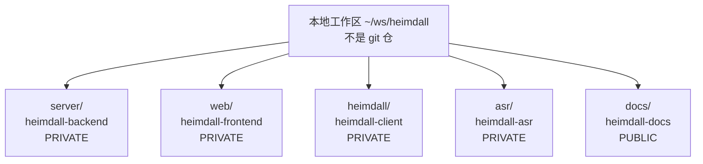
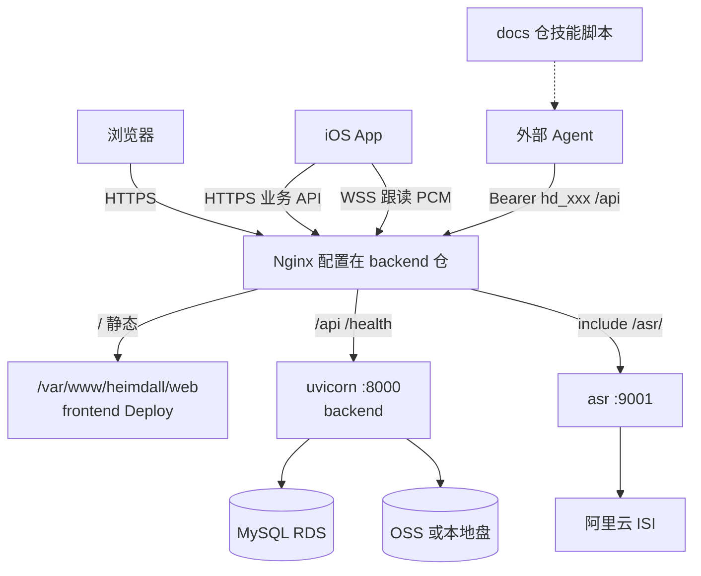
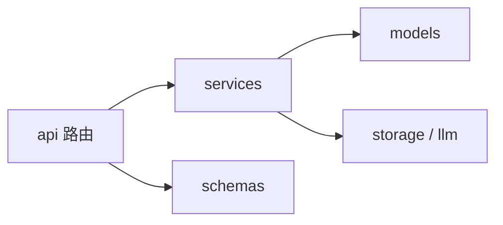
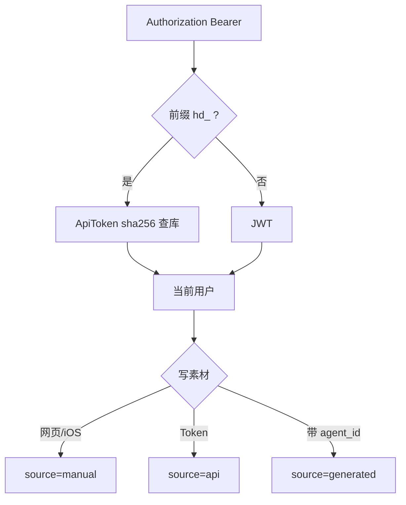
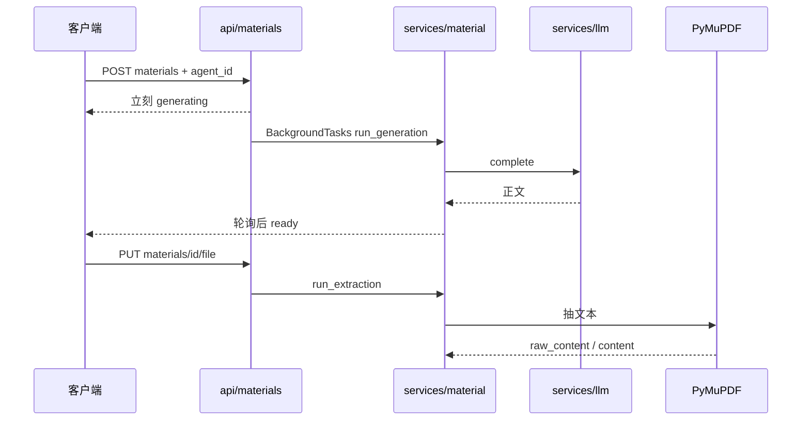
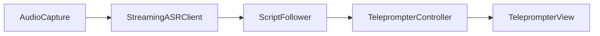
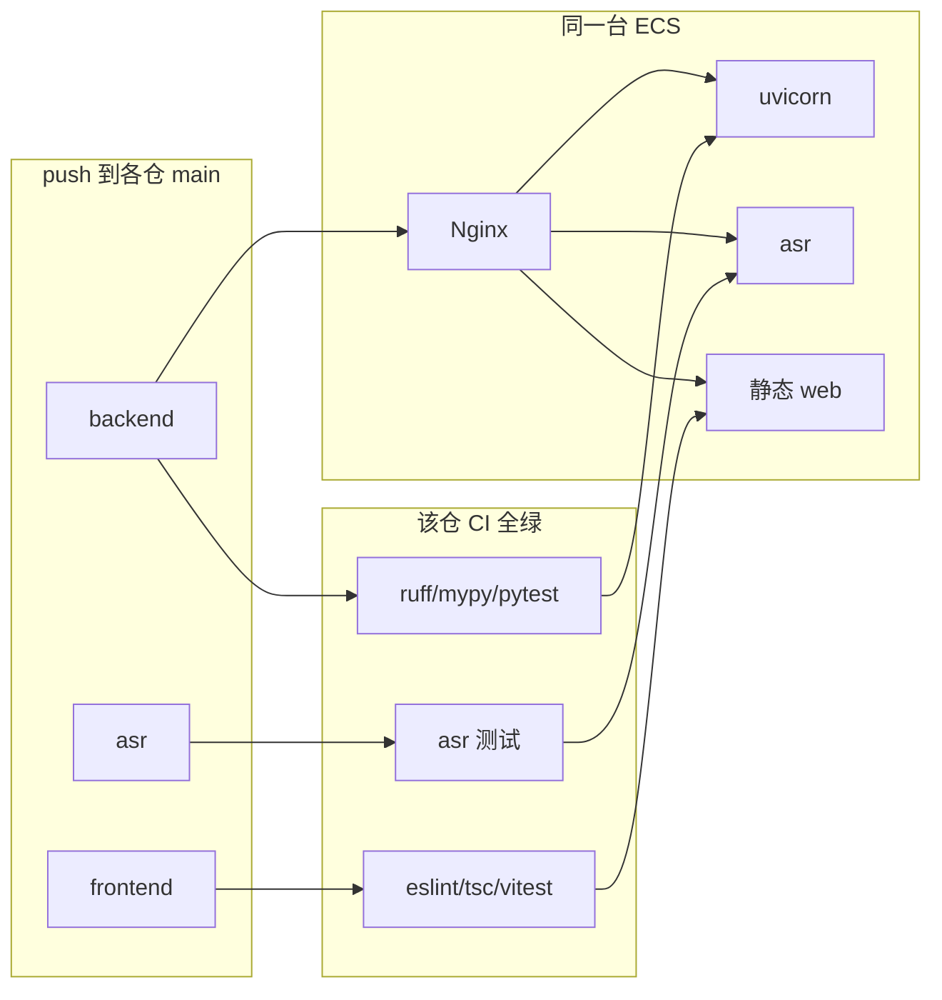
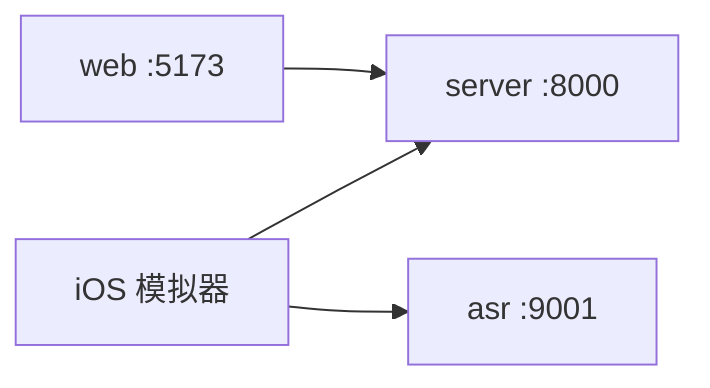

# Heimdall 技术实现交接

给继续写代码的人。重点是**仓库怎么拆、各自干什么、运行时怎么接上**。

- 产品能力见 [`prds/Heimdall PRD 1.0.md`](./prds/Heimdall%20PRD%201.0.md)
- HTML 版见 [`Heimdall-技术实现交接.html`](./Heimdall-技术实现交接.html)

工作区 `~/ws/heimdall` **不是 git 仓库**。里面是 5 个独立 GitHub 仓。改代码、提交、发版都按仓走。

---

## 1. 仓库总表

GitHub 组织：`hackingangle`。默认分支都是 `main`。



| 本地目录 | GitHub | 可见 | 技术栈 | 生产职责 | CI / Deploy |
|---|---|---|---|---|---|
| `server/` | [heimdall-backend](https://github.com/hackingangle/heimdall-backend) | 私有 | Python 3.11 · FastAPI · uv · SQLAlchemy · Alembic · MySQL | API `:8000`、主站 Nginx/SSL、迁移、systemd | 有 |
| `web/` | [heimdall-frontend](https://github.com/hackingangle/heimdall-frontend) | 私有 | React 19 · TS · Vite · Ant Design · TanStack Query | 静态文件 → `/var/www/heimdall/web/` | 有 |
| `heimdall/` | [heimdall-client](https://github.com/hackingangle/heimdall-client) | 私有 | SwiftUI · `heimdall.xcodeproj` | 不走 ECS；TestFlight / 真机 | 无 Deploy |
| `asr/` | [heimdall-asr](https://github.com/hackingangle/heimdall-asr) | 私有 | Python · WebSocket · 阿里云 ISI/NLS | `:9001` + Nginx `/asr/` | 有 |
| `docs/` | [heimdall-docs](https://github.com/hackingangle/heimdall-docs) | 公开 | Markdown / 技能脚本 | 不部署 ECS；`setup-heimdall.sh` 从此仓 raw 拉 | 无 Deploy |

**不是仓，不要当发布入口：**

| 路径 | 说明 |
|---|---|
| 工作区根 `README.md`、`.cursor/rules/` | 只存在本机。架构原则、VERSION +1 在这里。根目录没有 remote。 |
| 工作区 `deploy/` | 历史遗留。真脚本在各仓自己的 `deploy/`。 |

---

## 2. 怎么拿到代码

目录名必须如下，各仓 `CLAUDE.md` 按这个相对路径写。四个私有仓需要 collaborator。

```bash
mkdir -p ~/ws/heimdall && cd ~/ws/heimdall

git clone https://github.com/hackingangle/heimdall-backend.git  server
git clone https://github.com/hackingangle/heimdall-frontend.git web
git clone https://github.com/hackingangle/heimdall-client.git   heimdall
git clone https://github.com/hackingangle/heimdall-asr.git      asr
git clone https://github.com/hackingangle/heimdall-docs.git     docs
```

功能改动：各自开分支、各自 PR、各自 push。前后端各改各的 `VERSION`。

---

## 3. 运行时怎么接上

生产同一台 ECS，域名 `www.agoodbit.com`。



要点：

- ASR **不落盘、不读项目/素材**，只回 `partial` / `final`。
- MySQL、OSS 只被 backend 访问。
- 主站 Nginx 必须 `include /etc/nginx/heimdall-includes/*.conf`，否则 backend 部署会冲掉 `/asr/`。

---

## 4. 分仓实现

### 4.1 heimdall-backend（`server/`）

控制平面。只做机制：鉴权、存数据、调 LLM、管文件。不内置调研/写稿策略，不内置 DAG。

```
app/
  main.py          装配 FastAPI、CORS、挂路由
  config.py        HEIMDALL_ 前缀
  db.py            engine / Session / get_db
  api/             auth projects materials agents tokens llm_configs health debug
  services/        规则、生成、抽取、存储
  models/          User Project Material Agent LlmConfig ApiToken
  schemas/         对外契约
  core/            异常、JWT/Token、日志
alembic/
deploy/            仅给 CI
VERSION            整数 → 顶栏「后端 vM」
```

依赖单向：`api → services → models`。



**双鉴权**（`app/core/deps.py`）：



**创作与 PDF：**



- 错误体：`{"error":{"code","message"}}`。service 抛 `HeimdallError`，不要 `HTTPException`。
- 存储：`HEIMDALL_STORAGE_BACKEND=local|oss`，选 oss 时启动即校验四项。
- 命令：`make install && make migrate && make dev` · `make check`
- 约定：`server/CLAUDE.md`

### 4.2 heimdall-frontend（`web/`）

只消费 backend REST。分层：`pages → hooks → api`。组件不直接打接口。

```
src/main.tsx       路由
src/App.tsx        顶栏：项目 / 智能体 / 技能引导
src/api/           axios
src/hooks/         TanStack Query，缓存键 xxxKeys
src/pages/
src/components/    纯 props
VERSION            整数 → 顶栏「前端 vN」
```

路由：`/login` · `/projects` · `/projects/:id` · `/projects/:id/materials/:materialId` · `/agents` · `/guide`

- 生成中：有 `generating` 行则 2s 轮询，不接 WebSocket。
- 网页提词是**定速滚动**，没有 ASR。
- 命令：`npm run dev` · `npm run check` · `npm run build`
- 约定：`web/CLAUDE.md`

### 4.3 heimdall-client（`heimdall/`）

SwiftUI。业务对齐网页，**跟读只在本仓**。

```
heimdall.xcodeproj
heimdall/heimdallApp.swift
heimdall/RootView.swift
heimdall/App/AppConfig.swift     默认生产 API / ASR
heimdall/Networking/
heimdall/Stores/
heimdall/Features/Teleprompter/
```



默认：

- API：`https://www.agoodbit.com`
- ASR：`wss://www.agoodbit.com/asr/`

项目导航必须在根 `NavigationStack` 注册 `ProjectsRoute`。子页再挂 `navigationDestination` 会导致素材点击静默失败。

### 4.4 heimdall-asr（`asr/`）

独立进程。iOS 协议不变。不知项目、不落盘。

| `ASR_MODE` | 用途 |
|---|---|
| `isi` | 生产推荐。NLS 中间结果 → partial，句尾 → final |
| `mock` | 无云联调 |
| `dashscope` | 百炼备选。不要用百炼 `sk-` 当 NLS Token |

```
server.py
isi_backend.py
deploy/nginx/asr-location.conf  →  /etc/nginx/heimdall-includes/asr.conf
```

健康检查：`https://www.agoodbit.com/asr/health`

### 4.5 heimdall-docs（`docs/`）

公开。网页技能引导和 `setup-heimdall.sh` 依赖本仓 raw 地址。

| 文件 | 用途 |
|---|---|
| `prds/Heimdall PRD 1.0.md` | 现行产品说明 |
| `Heimdall-技术实现交接.md` | 本文 |
| `skills/claude-code/` | doctor / collect / material |
| `superpowers/specs/` | 设计规格 |
| `prds/Heimdall PRD.md` | 旧愿景，勿当实现依据 |

---

## 5. 发布：一仓一流水线

生产只许 GitHub Actions **Deploy**。禁止本机 `deploy.sh` / rsync / 手工 SSH 改线上代码。密钥只存在各仓 Secrets。



| 要更新 | 推哪个仓 | 线上怎么验 |
|---|---|---|
| API / 迁移 / 主站 Nginx | heimdall-backend | `curl https://www.agoodbit.com/health` |
| 网页 UI | heimdall-frontend | 刷新站点 |
| 跟读转写 | heimdall-asr | `curl -sf https://www.agoodbit.com/asr/health` |
| iOS | heimdall-client | Xcode 归档，不走 ECS |
| 技能 / PRD | heimdall-docs | push 即公开，无 Deploy |

首次上机顺序：**backend → frontend → asr**。

Secrets 名称（值在 GitHub，本文不写）：

- 三仓共用 SSH：`DEPLOY_HOST` `DEPLOY_USER` `DEPLOY_SSH_KEY`
- backend：`HEIMDALL_DATABASE_URL` `HEIMDALL_JWT_SECRET` `HEIMDALL_REGISTRATION_PASSPHRASE` `HEIMDALL_CORS_ORIGINS` `HEIMDALL_LLM_*` `HEIMDALL_OSS_*`
- frontend：`VITE_API_BASE=https://www.agoodbit.com`
- asr：`ASR_MODE` `NLS_APPKEY` `ALIYUN_AK_ID/SECRET` `ASR_PUBLIC_URL`

细目以各仓 `deploy/README.md` 为准。

---

## 6. 版本号

顶栏：`前端 vN · 后端 vM`。只能是递增整数。

- 改 `web/` 行为 → 同一 commit `web/VERSION` +1
- 改 `server/` 行为 → 同一 commit `server/VERSION` +1
- 两边都改 → 两个仓各 +1、各提交
- 只改文档 / 规则、行为不变 → 不 bump

---

## 7. 本地联调

```bash
# 终端 1
cd server && make install && make migrate && make dev          # :8000

# 终端 2
cd web && cp .env.example .env.local && npm i && npm run dev  # :5173
# VITE_API_BASE=http://127.0.0.1:8000

# 终端 3（跟读才需要）
cd asr
python3 -m venv .venv && source .venv/bin/activate
pip install -r requirements.txt
ASR_MODE=isi NLS_APPKEY=… ALIYUN_AK_ID=… ALIYUN_AK_SECRET=… python server.py

# Xcode 打开 heimdall/heimdall.xcodeproj
# Settings：API http://<局域网IP>:8000
#           ASR ws://127.0.0.1:9001
```



---

## 8. 改代码红线

- 不要加 Task / Record / Generation。创作结果就是 Material。
- 不要在 backend 做 DAG、能力路由、扇入扇出。
- 加字段先问：现有列能不能承载。规则：工作区 `.cursor/rules/architecture-simplicity.mdc`。
- 加依赖：backend 用 `uv add`，frontend 用 `npm install`。
- 提交前：backend `make check`，frontend `npm run check`。
- 旧 README 仍写「tasks/records 待实现」——已否决，以 `CLAUDE.md` 和 6 张表为准。

---

## 9. 文档对照

| 文件 | 给谁 |
|---|---|
| 本文 | 工程师：仓库与实现 |
| [`prds/Heimdall PRD 1.0.md`](./prds/Heimdall%20PRD%201.0.md) | 投资人 / 产品 |
| [`Heimdall-交接手册.html`](./Heimdall-交接手册.html) | 综合交接（含未合并分支快照） |
| `server/CLAUDE.md` · `web/CLAUDE.md` | 在对应仓改代码时的约定 |
