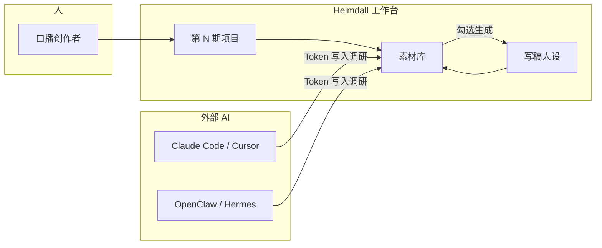
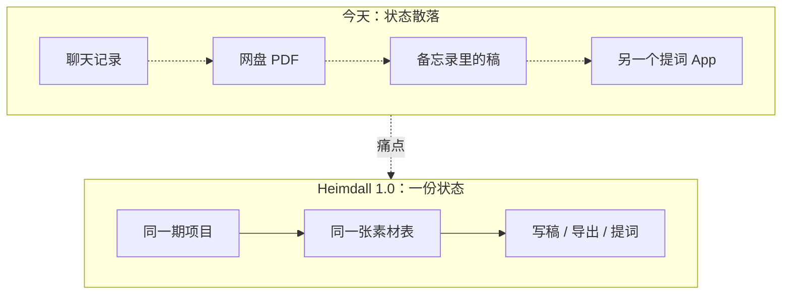
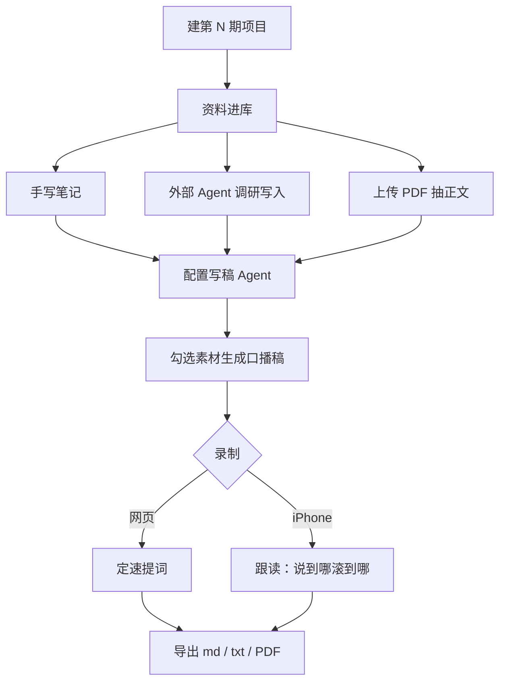
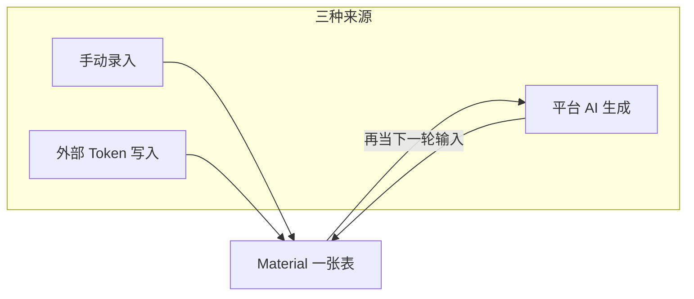
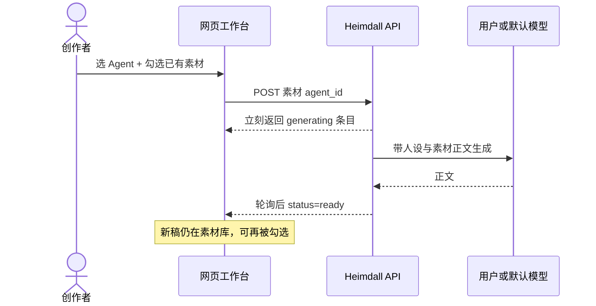
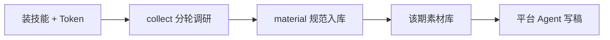
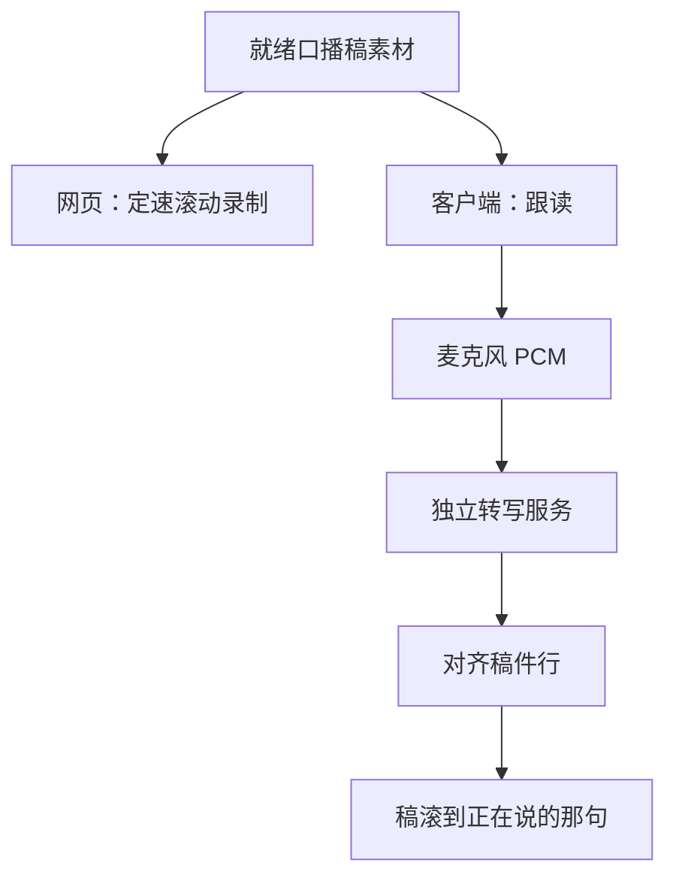
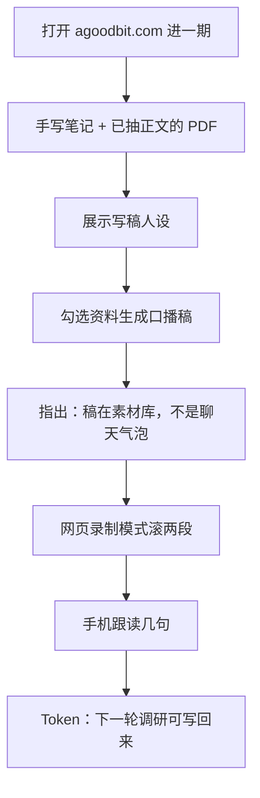

# Heimdall 1.0 — 产品需求文档

> **口号**：从选题到成片的一站式创作台。  
> **依据**：2026-08 已上线实现（[www.agoodbit.com](https://www.agoodbit.com) + iOS 客户端），不是早期「任务表编排」愿景稿。  
> 早期立项稿见 [`Heimdall PRD.md`](./Heimdall%20PRD.md)（v0.3，仅历史）。  
> 讲解页：[`../Heimdall-PRD-1.0.html`](../Heimdall-PRD-1.0.html)

---

## 1. 产品是什么

**Heimdall**（海姆达尔）取名北欧神话中彩虹桥的守望者：一边连着创作者，一边连着各种 AI 工具。

1.0 做成的是一套**口播内容创作操作系统**，验证场景锁定 **YouTube / 短视频口播稿**：

1. 一期节目的调研、PDF、口播稿、标题文案，都放进同一个项目。
2. 人可以在网页和手机上写、改、看、录。
3. Claude Code、Cursor、OpenClaw、Hermes 凭一把钥匙把资料写进来、把人设读出去。
4. 平台内 Agent 基于已有素材生成下一稿——**生成结果仍是素材**，可以再改、再生成、再提词。

一句话：**不是又一个聊天窗口，而是创作者和多个 AI 共用的那张工作台。**

---

## 2. 要解决的问题

口播创作者已经在用 AI，但工作流是碎的：

| 环节 | 今天怎么做 | 痛点 |
|---|---|---|
| 调研 | 搜索 / 爬虫 / 网盘 PDF / 各家对话各写各的 | 资料散落，下一期找不到 |
| 写稿 | 再开一个对话，把资料粘进去 | 上下文靠复制，无法复用 |
| 改稿 | 本地 Word / 备忘录 | 不知道这稿用了哪些料 |
| 录制 | 再抄进提词 App | 稿和镜头是两套工具 |
| 换模型 | 换工具就换一套记忆 | Agent 之间没有共享状态 |

1.0 不声称「全自动出片」。它先把**状态**做对：一期节目只有一个项目，一份内容只存一次。

---

## 3. 目标用户与使用场景

### 3.1 主用户

独立或小团队的**中文口播创作者**（知识 / 人物传记 / 讲史 / 讲经等长口播）。已经在用 AI 写稿，缺一个能把「资料 → 稿 → 录」收拢的地方。

### 3.2 次用户

外部 Agent / Harness（Claude Code、Cursor、OpenClaw、Hermes）。通过 API Token 读写同一套项目与素材。

### 3.3 1.0 主场景（已跑通）

做一期「虚云老和尚」口播：

---

## 4. 1.0 产品原则（已落地）

1. **创作结果即素材** — 手动、外部 AI、平台生成，三种来源一张表。没有「产物 / 任务看板 / 生成记录」实体。
2. **机制与策略分离** — 平台负责存、鉴权、调模型、管文件；怎么调研、怎么拆大纲，由技能或用户的 Agent 决定。
3. **人和 AI 走同一扇门** — 网页登录，工具用 `hd_` Token，打同一套接口。
4. **先做一期节目** — 1.0 不内置 DAG，不自动派发五步任务表。

---

## 5. 已实现功能（1.0 范围）

以下均可演示。

### 5.1 账号与准入

| 能力 | 说明 |
|---|---|
| 注册 / 登录 / 退出 | 邮箱或用户名登录；可填昵称、手机、头像 |
| 邀请制 | 生产注册需管理员暗号 |
| 个人资料 | 显示名、emoji 头像（网页与客户端一致） |
| 多用户隔离 | 项目、素材、Agent、Token、模型配置按用户隔离 |

### 5.2 项目管理（一期节目）

| 能力 | 说明 |
|---|---|
| 新建 / 编辑 / 删除 | 期数、标题、栏目 |
| 期数自动递增 | 同一用户内唯一；冲突明确提示 |
| 进入工作台 | 点进一期，同时看素材库与创作面板 |

### 5.3 素材库（核心对象）

一期节目里，**所有内容都是素材**。

| 能力 | 说明 |
|---|---|
| 文本素材 | Markdown 撰写、预览、就地编辑 |
| 来源分层 | 手动 / 外部 API / AI 生成，列表可筛选 |
| PDF 原件 | 上传到对象存储；数据库只存索引 |
| 自动抽正文 | 可检索 PDF 抽出文本；扫描件标解析失败（1.0 不做 OCR） |
| 原始留档 | 来源链接、清洗前底稿、二进制原件随素材保存 |
| 生成溯源 | 记录 Agent、输入素材、补充指令、失败原因 |
| 列表性能 | 分页；列表不回传全文 |

### 5.4 智能体与模型

| 能力 | 说明 |
|---|---|
| Agent 管理 | 名称、用途、系统提示词 |
| 自有模型接入 | 兼容 OpenAI 的地址 / 密钥 / 模型名；密钥回显掩码 |
| 绑定 | Agent 可指定一条模型配置；空则用平台默认 |
| 内外共用 | 网页创作用这些 Agent，外部工具也可读走人设 |

### 5.5 平台内 AI 创作

| 能力 | 说明 |
|---|---|
| 勾选输入 | 只消费已有可用正文的素材 |
| 一键生成 | 选 Agent + 可选补充指令 |
| 后台完成 | 成功写入正文，失败保留原因 |
| 链式创作 | 大纲、口播稿、标题都可以再当输入 |
| 不另开对话 | 创作发生在项目里 |

### 5.6 外部 Agent 接入（彩虹桥）

| 能力 | 说明 |
|---|---|
| API Token | 网页签发，明文只显示一次，可吊销 |
| 智能体页安装 | Claude Code / Cursor / Codex 一键安装 |
| doctor | 自检连通 |
| collect | 分轮调研，可续跑 |
| material | 入库规范：留原文、留出处、不过度摘要 |

### 5.7 导出与录制

| 能力 | 网页 | iOS / iPad / Mac |
|---|---|---|
| 复制 / 下载 .md / .txt / PDF | 有 | 阅读与导出对齐工作台 |
| 定速提词 | 全屏大字、匀速滚、点段落重定位 | — |
| 跟读提词 | — | 边说边翻篇；口令回上一句 |

跟读转写只负责「听清说了什么」，不读取项目内容。

### 5.8 客户端与站点

| 端 | 1.0 状态 |
|---|---|
| 网页工作台 | 已上线 [www.agoodbit.com](https://www.agoodbit.com) |
| iOS / iPadOS / macOS | 登录、项目、素材、创作、Agent、Token、模型、技能、跟读 |
| 外部 Agent | 生产 API + 公开技能包 |

---

## 6. 用户故事（1.0 已满足）

- **作为创作者**，我要按「第几期」管理节目，资料和稿不混。
- **作为创作者**，我要把 PDF 和网页调研放进同一期，写稿时勾选它们。
- **作为创作者**，我要保存写稿人设和常用模型，而不是每次重写提示词。
- **作为创作者**，我要在网页定速录，或在手机边说边跟稿。
- **作为使用 Claude Code / Cursor 的创作者**，我要发一把 Token，让工具把调研写进 Heimdall。
- **作为管理员**，我要用邀请暗号控制谁能注册。

---

## 7. 明确不在 1.0 的范围

- 不从「一个选题」无人值守跑完调研到发布
- 不做平台内置任务编排引擎、多 Agent 调度市场
- 不做剪辑时间线、自动烧字幕、广告分发
- 不做扫描件 OCR、音视频精编
- 不做团队空间（1.0 是单人工作台）
- 网页不做跟读 ASR（跟读只在客户端）

---

## 8. 非功能需求（1.0 已按此交付）

| 项 | 1.0 标准 |
|---|---|
| 可用性 | 网页与客户端覆盖同一条创作主路径 |
| 数据归属 | 按账号隔离；Token 可吊销即失效 |
| 可恢复创作 | 生成中刷新页面，条目仍在 |
| 可观测 | 顶栏前后端版本；客户端诊断日志 |
| 发布 | 生产只经 CI；密钥不进仓库 |
| 性能 | 素材列表分页 |

---

## 9. 成功标准 / 讲解顺序

现场 8–10 分钟走完即验收：

闭环成立，即 1.0 产品成立。

---

## 10. 商业与下一步

1.0 验证的是：创作者是否愿意把**一期节目的全部中间物**放在 Heimdall，而不是继续散落在聊天记录里。

不计入本期验收：更稳的跟读、更深的素材理解、轻量团队、按用量收费。

---

## 11. 名词

| 词 | 含义 |
|---|---|
| 项目 / 期 | 一期节目 |
| 素材 | 项目内唯一内容对象 |
| Agent | 可复用的创作人设 |
| Token | 外部 AI 的钥匙 |
| 技能 | 教外部 AI 如何调研、如何入库 |
| 提词 / 跟读 | 对着稿录；跟读 = 语音对齐自动翻篇 |

---

## 变更记录

| 日期 | 版本 | 说明 |
|---|---|---|
| 2026-08-19 | 1.0 | 按已实现功能重写；补核心流程图。 |
